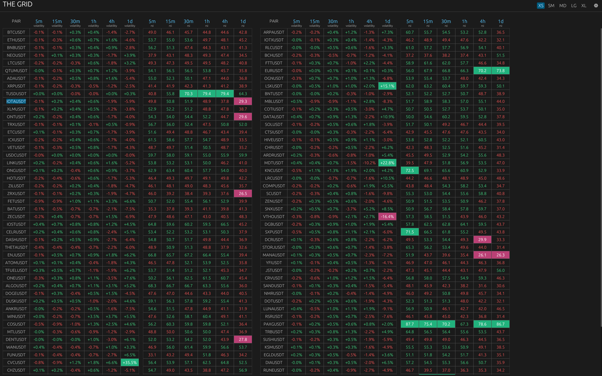

# The Grid — Realtime multi-timeframe crypto radar ⚡

Pragmatic Rust trading dashboard that ingests live Binance market data, runs streaming RSI/volatility analytics, and paints a fast, configurable view for quants and curious OSS traders.

Built as a terminal UI with `ratatui`—no web or mobile frontend.

## Screenshot 🖥️



## Videos 🎥

- Watch The Grid walkthroughs on the [Dekay YouTube channel](https://www.youtube.com/@karthik947) and the curated [playlist](https://www.youtube.com/playlist?list=PLWwN_JDNbVc4-yWSJZ4lKr0os8rAfEaAH).

## Why The Grid 🤔

- Built for traders who want live, multi-timeframe signal scanning without spreadsheet lag.
- Built for quants who appreciate deterministic, typed pipelines and explicit state machines.
- Built for Rust/TUI enthusiasts who want a clean ratatui example with async backends.

## Highlights ✨

- Realtime streaming: Binance websocket fan-out into an async indicator engine; TUI redraws on batched updates. ⚡
- Configurable presets: pairs, RSI length/source, indicator timeframes, thresholds. 🧰
- Multi-timeframe indicators: RSI + volatility computed per pair/timeframe with indexed slots for O(1) lookup in the UI. 🧭
- Resilient I/O: websocket reconnect with reboot events; REST warmup with a sliding-window rate limiter to respect Binance quotas. 🔄
- Decoupled services: Engine, HistoryService, WsClient, and Dashboard UI communicate over typed mpsc buses to isolate failure domains. 🧩
- Visuals that adapt: smart column packing, sticky headers, threshold-aware coloring, and dedicated layout/preset panels. 🎨
- Lean runtime: TUI + delta/quantized updates cut memory usage by ~8x, around 50MB for up to 100 pairs. ⭐

## Architecture (rust + tokio + ratatui) 🏗️

- Runtime: tokio multi-thread runtime hosts background tasks (Engine, HistoryService, WsClient) started from `src/main.rs`.
- Data ingress: `WsClient` (`src/ws.rs`) streams 1m klines from Binance; on errors/closes it sends reboot signals and retries after 5s.
- Warmup/history: `HistoryService` + `KlineStore` hydrate indicator state via the Binance REST adapter (`src/adapters/binance.rs`) with per-minute rate limiting.
- Indicator core: `Engine` (`src/engine`) maintains RSI/volatility state machines, handles warmup gating, batches indicator values every ~2s, and emits `UiMessage::IndicatorResults`.
- Message buses: `EngineBus`, `HistoryBus`, `WsBus`, `UiBus` (`src/message_bus/*`) wrap mpsc channels to keep UI/engine/ws/history decoupled.
- UI: `DashboardApp` (`src/ui/app.rs`) and render pipeline (`src/ui/ui.rs`) consume indexed slots from `config::IndexLookup` to paint a table of pairs x timeframes with live values.

## How it works 🧠

1. Configure pairs + indicator settings in the UI (or load a preset) → generates `AppConfig` with per-indicator/timeframe slots.
2. `WsClient` builds a multiplexed Binance stream URL; each kline becomes an `EngineMessage::Kline`.
3. `Engine` routes bars through indicator state, pushes results into indexed slots, and emits a full snapshot once, then deltas (quantized) thereafter.
4. UI consumes batches, repaints, and applies thresholds/colors.
5. Config changes trigger a reboot: engine state resets, history warmup kicks in, and ws restarts with the new streams.

## Quickstart 🚀

- Prereqs: Rust toolchain (stable), `cargo`.
- Run the app:
  ```bash
  ./scripts/run_dev
  ```
- Platform notes: macOS/Linux tested; uses `tokio` multi-thread runtime and a `ratatui` terminal UI.

## Configuration & usage (UI) 🛠️

- Pairs: comma-separated input (default `BTCUSDT,ETHUSDT`). Empty pairs are rejected by the websocket builder.
- Indicators: toggle Volatility/RSI independently; set RSI length (default 14) and source (Open/High/Low/Close). Per-timeframe toggles for both indicators.
- Thresholds: per-timeframe volatility thresholds; RSI overbought/oversold defaults (70/30) shown in the UI.
- Presets: select/create/save in the settings panel. Active preset drives the running config; presets persist via `confy` under the app name `the_grid` with key `dashboard_presets`.

## UI tour 👀

- Intro screen: branded splash shown on startup before entering the dashboard.
- Top bar: title + settings button.
- Dashboard: sticky headers for timeframes, scrollable body grouped by columns, pair names on the left, indicator values to the right.
- Colors: timeframe labels in blue; toggle switches share the accent color; thresholds influence indicator coloring.
- Repaint cadence: live updates trigger immediate repaint; idle mode schedules refresh ~every 2s.
- Settings panel: presets, pairs input, volatility section with per-timeframe thresholds, RSI section with length/source/timeframes, save/cancel controls.
- Layout panel: column and layout controls moved out of settings for quicker visual tuning.

## Reliability & performance 🏎️

- Rate limiting: REST adapter enforces a sliding window (~1,200 calls/min max by default).
- Reconnects: websocket retries every 5s with reboot events to reset engine state.
- Batching: indicator results flushed roughly every 2s to reduce UI churn while keeping signals fresh.
- Delta updates: indicator values are quantized (volatility to 1 decimal, RSI to 0) and only changed values are sent to the UI.
- Warmup gating: engine defers live processing until warmup requests are sent and initial history seeds the indicators.
- Thread model: tokio multi-thread runtime; UI runs on the native eframe thread; background tasks stay async.

## Testing & development ✅

- Coverage is still light as I’m learning Rust and growing the test suite—expect gaps beyond the adapter tests.
- Run the suite:
  ```bash
  cargo test
  ```
- Notable coverage: Binance adapter tests (rate limiter windowing, timeframe translation, kline parsing).
- Logging: structured logging initialized in `src/logger.rs`. Logs write to `logs/` in dev, and to OS-specific log folders in release (macOS `~/Library/Logs/<app>`, Windows `%LOCALAPPDATA%/<app>/Logs`, Linux `~/.local/state/<app>/logs`).

## Roadmap 🧭

- Expand indicators: add MA cross variants, MACD, Bollinger Bands, and volume/OBV signals; keep per-timeframe toggles and thresholds consistent with existing UX.
- Improve test coverage: grow adapter and engine unit tests, add integration tests for config/preset flows, and add regression cases for indicator math and slot indexing.
- Optimize memory and CPU: tighten allocations in slot/index lookup, reuse buffers in indicator pipelines, and profile UI/engine channels to support higher throughput with lean footprints.

## Disclaimer 🛡️

- Educational only: this dashboard is for learning and experimentation; it is **not** financial advice or a production trading system.
- Open source forever: the goal is to stay OSS to learn Rust trading systems, share ideas, and contribute back to the community.
